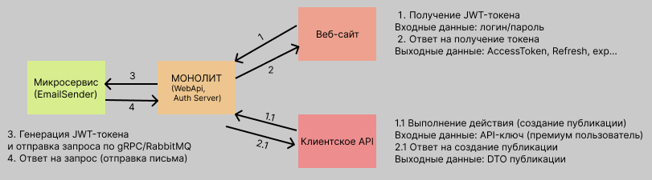

# CRUD
Идемпотентное RESTful API для публикации статей на технологии ASP.NET Core.

Более 53.000 строк кода с XML и Swagger документацией.

Стек: C#, ASP.NET Core, SignalR, gRPC, MySQL, Redis, Entity Framework Core, RabbitMQ, xUnit,
Moq, WebApplicationFactory, BenchmarkDotNet, Монолитная + микросервисная
архитектура, Domain Models, DTO, внедрение зависимостей, SOLID, DRY, TDD,
JWT (Access/Refresh Tokens), OAuth 2.0, асимметричное шифрование (RSA),
Интеграция с внешними API, FluentValidation, DataAnnotations, OpenTelemetry,
Prometheus, HeathCheck, S3 (AWS S3), Swagger, Bruno, Postman, User Secrets.

 

