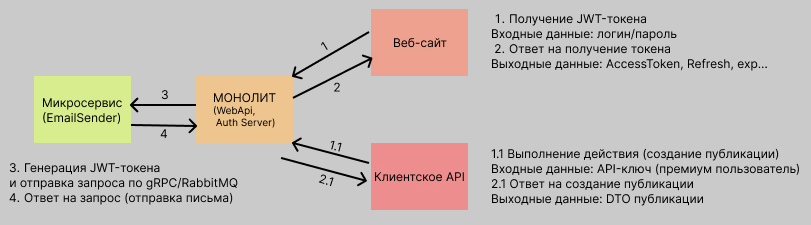
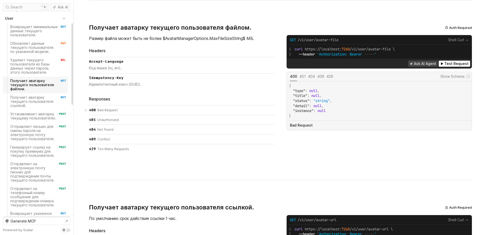

# CRUD
Идемпотентное RESTful API для публикации статей на технологии ASP.NET Core (.NET 10).

Это мой сольный проект, над которым я работаю уже более года (с марта 2025).

**Цель:** Самостоятельно разработать Web API и внедрить в него, как можно больше актуальных и современных технологий. Использовать лучшие практики. В качестве основного источника информации использовать официальную документацию Microsoft.

## Стек
- C# / .NET 10
- ASP.NET Core
- Entity Framework Core
- xUnit (v3), Moq
- FluentValidation
- OpenTelemetry
- Serilog

## Инфраструктура
- MySQL
- SignalR
- gRPC
- Redis (ValKey)
- RabbitMQ
- Prometheus
- S3 (AWS)
- Swagger, Scalar
- Git
- Монолитная и микросервисная архитектуры

## Внешние сервисы
- Telegram (отправка верификационных кодов)
- SMS AERO (отправка СМС)
- Mail Ru (отправка электронных писем и поддержка регистрации по OAuth)
- YooKassa (оплата продуктов — премиума)

## Функции
- Все конечные точки написаны на `Minimal API` с использованием `TypedResult`.
- Русская и английская локализация HTTP-ответов через ресурсы.
- HTTP-ответы в формате `Problem Details` с кастомными полями.
- Версионирование API (`v1`,`v2`...).
- Полностью описанная `Swagger/Scalar`-документация с кастомными `Transformer`'ами.
- Применение миграций базы данных при запуске приложения.
- Настройка `S3` экосистемы при запуске приложения (создание папок, копирование файлов из архива).
- Логирование через `ILogger` `Serilog` с записью в файл и сохранением этих файлов в `S3`.
- Логирование HTTP-запросов с дополнительными настройками по типу: не логирование запросов `"/metrics"`, скрытие `access_token` в параметрах запроса (актуально для `SignalR`).
- Кэширование HTTP-ответов (`OutputCache`) с использованием `Redis`'а.
- `HybridCache`, `IMemoryCache`, `IDistributedCache`, отказоустойчивость.
- 13 `HealthCheck`'ов. От проверки подключения к базе до проверки подключения к `S3`, `Prometheus`, `Telegram`, `SignalR Hubs` и тд.
- 20 `Options`'ов для настройки сервисов и параметров API в `appsetting.json`. `IOptions`, `IOptionsMonitor`...
- Настройка `CORS` для клиента, настройка `Forwarded` заголовков (для прокси) + пользовательские заголовки.
- Настройка `RateLimiter`'ов для разных ролей пользователей.
- Центролизованная настройка `HttpClient`'ов через `IHttpFactory` (`services.AddHttpClient`) с политиками повторных попыток (`Polly`) + для `gRPC` клиентов тоже.
- Телеметрия с использованием `OpenTelemetry` и `Prometheus` + пользовательские метрики приложения (выдача премиума).
- Выделенный микросервис отправки электронных писем через `MailRu` провайдер, взаимодействие с основным монолитом через `gRPC` и `RabbitMQ`.
- Грамотная система очереди отправок писем с повторными попытками и ограничениями, которые можно настраивать через `appsetting.json`.
- Есть настройка для использования `Unix Domain Socket` в `gRPC`, вместо обычного варианта (`EmailSenderOptions.UseUnixDomainSocketGRPC`).
- Публичная статическая папка `public` в `wwwroot`, никакой логики не несёт, просто для изучения.
- Собственная реализация аутентификации/авторизации через публичные асимметричные ключи (`RSA`) + пользовательские `Claim`'ы.
- Поддержка `OAuth MailRu` (не библиотека), т. е. генерация `CodeVerifier`, `CodeChallenge`, `Nonce` и весь `codeflow` в моих руках.
- Микросервис получает публичные ключи через конечную точку `"/.well-known/jwks.json"` + умный механизм кэширования и повторые попытки.
- Выдача и отзыв `Refresh` токенов, в том числе и автоматический отзыв.
- Пользовательский глобальный обработчик событий и `Middleware`'ы.
- Пользовательские конверторы для `JsonOptions`.
- Пользовательские интерсепторы для `gRPC` в микросервисе (например, для `RPC` исключений).
- Система уведомлений через `SignalR` (любое содержимое через админ-панель, например, "Цена обновилась") + поддержка `MessagePack`.
- Админ-панель.
- Валидаторы для всех `DTO` моделей, реализованы через `FluentValidation` + дополнительная локализация и кастомные правила.
- Описанный `adr` (Architectural Decision Records) для валидации моделей (`"/docs/adr/0001-валидация-domain-и-dto-моделей.md"`).
- Пользовательские фильтры для конечных точек (например, валидация модели, проверка IP-адреса для вебхука оплаты, добавление идемпотентности).
- `MySQL` база данных с полноценной настройкой сущностей через `Fluent API` (`Entity Framework`). Более 50 миграций.
- Наследование (`TPT`), `один-к-одному`, `один-ко-многим`, `многие-ко-многим`.
- Обработка конфликтов параллельности (гонки) внутри сервисов.
- Проецирование нужных данных, `AsNoTracking`, `ExecuteUpdateAsync`, `ExecuteDeleteAsync`.
- Отдельный локальный `NuGet`-пакет для `S3` интеграции, т. к. написанный функционал используется, как в монолите, так и в микросервисе, с целью избежания повторюшкиного кода.
- Постраничные списки (`PaginatedList`).
- Хэширование паролей, создание API-ключей для премиум пользователей.
- Использование `DataProtection` для смены пароля + кэширование и `RateLimiter`.
- Интеграция с `ЮКассой` для оплаты Premium'а, создание заказов.
- Специальный клиентский API для премиум пользователей с API-ключами.
- Интеграция с `SMS` провайдером и `Telegram'ом` для подтверждения номера телефона через СМС.
- Аватарки пользователей с сохранением в `S3`, проверка сигнатуры файла через первые байты файла + выдача аватарок, как файлом, так и ссылкой.
- Интеграция с `MailRu` провайдером для отправки электронных писем (смена пароля, подтверждение почты).
- Проверка вредоносного кода и недопустимых тегов в содержимом публикации `HTML`.
- `Result`-паттерн в сервисах, вместо привычного `exception-паттерна` (управление кодом через исключения).
- Принципы ООП  + `record`, `sealed`, `init` и т. д.
- Весь функционал покрыт `Unit`, интеграционными, системными, и нагрузочными тестами + `Benchmark` для некоторых участков кода.
- Для тестов используется отдельная реальная облачная база данных (с пересозданием, в некоторых случаях `InMemory` или через `Testcontainers.MySql`). Настроенный `xunit.runner.json`, коллекции и `Fixture`'ы.

Это основные, интересные функции, которые я вспомнил, пока писал это :) 
Понятное дело, какие-то мелочи я упоминать не стал, в счёт их огромного количества. 
Не стоит забывать, что все технологии и идеи нужно грамотно и искуссно слепить в один проект, что у меня и вышло. 
За время разработки этого проекта у меня сформировался определённый `code style`, которому я старался соответствовать, что тоже не мало стоит. 
Я не писал тяп-ляп, я вдумчиво погружался в новую тему и внедрял в проект, тестировал и комментировал код.

Истории коммитов нет т. к. для разработки использовался локальный репозиторий, некоторые коммиты пришлось бы скрывать, а мне лень всё разбирать.

## Запуск
- Скачать исходный код.
- Создать в корне папку `nugets`.
- Вызвать упаковку для `CRUD.Shared` и `CRUD.Infrastructure.S3`. Они упакуются в папку `nugets` и будут использоваться, как локальные `NuGet`-пакеты. Команда для упаковки `dotnet pack -c Release`.
- Заменить заглушки в файле `docker-compose.yml` на реальные значения `SmsSender`, `TelegramIntegration`, `PayManager`, `OAuthMailRu`, `SmtpServer`. 
<b>Либо</b> оставить, как есть, но некоторые функции не будут работать, такие как, отправка СМС и электронных писем, покупка премиума, авторизация через `OAuth Mail Ru`, верификационные коды `Telegram`. <ins>Без указания</ins> реального `SmtpServer` микросервис `EmailSender` даже не запустится. 
<i>[Подробнее про внешние сервисы в разделе выше](#внешние-сервисы)</i>
- Команда для запуска: `docker compose up --build`.

### Сервисы из docker-compose
| Название | Образ | Адрес | Назначение |
|---|---|---|---|
| `crud.webapi-1` | CRUD.WebApi | http://localhost:8080/openapi/index.html?url=/openapi/v1.json или `/scalar` | Основное Restful API. Swagger/Scalar. Админ: `admin`, `123` |
| `crud.webapplication-1`| CRUD.WebApplication | http://localhost:8082 | Небольшой малофункциональный сайт для теста SignalR уведомлений и загрузки публикаций (необходима авторизация для страницы "Уведомления"). |
| `crud.emailsender-1`| Microservice.EmailSender | http://localhost:8081 - HTTP2 (gRPC), http://localhost:8083 - HTTP1 (метрики) | Микросервис отправки электронных писем через gRPC или RabbitMQ. |
| `mysql-1`| mysql:8.0.25 | http://localhost:3306 | База данных MySQL. |
| `mysql_ui`| phpmyadmin:latest | http://localhost:8086 | UI базы данных MySQL (PHPMyAdmin). Вход: `root`, `password`. |
| `minio-1`| minio/minio:latest | http://localhost:9000 - API, http://localhost:9001 - UI | S3 хранилище, используется для хранения аватарок, логов. Вход: `minioadmin`, `minioadmin`. |
| `redis-1`| valkey/valkey:alpine | http://localhost:6379 | Распределённый кэш, используется в связке с HybridCache, кэширует идемпотентные ключи и различные токены. |
| `rabbitmq-1`| rabbitmq:management-alpine | http://localhost:5672 - API, http://localhost:15672 - UI | Брокер сообщений, используется для добавления электронных писем в очередь. |
| `prometheus-1`| prom/prometheus:latest | http://localhost:9090 | Сбор метрик WebApi и EmailSender. Конфиг в папке `configs`. |
 
- Перейти в `S3 UI` (http://localhost:9001) (`minioadmin`, `minioadmin`) и создать бакет `crud-backet`. Создать папку `archive` и загрузить в неё дефолтную аватарку (путь в репозитории: `/images/default.png`), чтобы сервис `WebApi` мог взять её и проинициализовать папку аватарок (`avatars`) при запуске. <i>Идея заключалась, в том, чтобы сервис брал данные из "архива", поэтому нужно этот архив создать.</i>
- Перезапустить `WebApi` для инициализации своих `S3`-папок.
- Можно запускать API (http://localhost:8080/openapi/index.html?url=/openapi/v1.json) и щупать всё и вся.  <b>Админ:</b> `admin`, `123`. Конечная точка авторизации: `/login`, группа `Auth`.

Запущенный Docker без заглушек:

Простенькая схема взаимодействия:

 

Что означают проекты в решении:

 

Пример ответа на запрос авторизации админа:

 

Scalar-документация:

 

Запущенные приложения: 
WebApi:

 

EmailSender:

 

